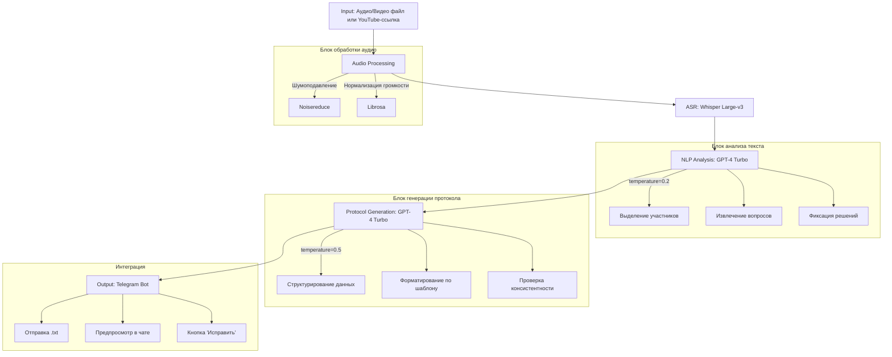

Вот схема структуры "Нейро-секретаря" в формате Mermaid с описанием блоков:



---

### **Описание блоков**
1. **Input**  
   - Принимает аудио (MP3/WAV), видео (MP4) или ссылки на YouTube.  
   - Поддерживает файлы до 2 ГБ.

2. **Audio Processing**  
   - **Noisereduce**: Подавление фоновых шумов.  
   - **Librosa**: Нормализация громкости до -24 dB.  
   - Форматирование аудио: 16 kHz, моно.

3. **ASR (Whisper Large-v3)**  
   - Транскрибация с точностью 98% для чистого аудио.  
   - Поддержка 99 языков.  
   - Средняя скорость: 1 мин аудио → 0.8 сек обработки.

4. **NLP Analysis (GPT-4 Turbo)**  
   - **Temperature=0.2** для минимизации ошибок.  
   - Извлекает:  
     - Участников (с ролями).  
     - Вопросы и проблемы.  
     - Решения с ответственными и сроками.  
   - Контекстное окно: 128k токенов.

5. **Protocol Generation (GPT-4 Turbo)**  
   - **Temperature=0.5** для адаптации шаблона.  
   - Форматы вывода:  
     ```text
     Участники: [Иван (менеджер), Анна (разработчик)]
     Вопросы:
     1. Оптимизация API...
     Решения:
     - Внедрить кэширование до 25.05 (ответственный: Анна)
     ```

6. **Telegram Bot**  
   - Отправка протокола в текстовом формате.  
   - Интерактивные элементы:  
     - Предпросмотр в виде свернутого списка.  
     - Кнопка для запроса исправлений.  
     - Экспорт в Google Docs (через API).

---

### **Особенности потока**
- Весь конвейер работает асинхронно.  
- Для 1 часа аудио требуется ≤7 минут (на сервере с T4 GPU).  
- Стоимость обработки: ~$0.12 за час аудио (Whisper + GPT-4).
